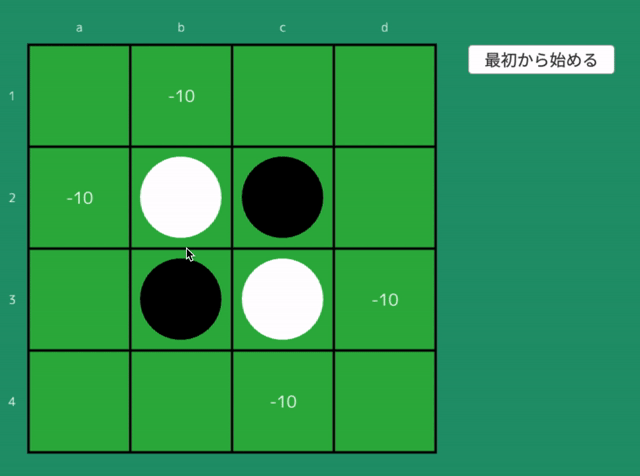

# 4x4オセロの完全解析

## 概要
絶対に勝てないオセロAIを[Siv3D](https://siv3d.github.io/ja-jp/)で実装しました。アルゴリズムはα-β探索、ボードの実装はビットボードを使用しました。

## 成果物

## 実行方法
* [Siv3D](https://siv3d.github.io/ja-jp/)をインストールしてsrc/Main.cppを実行する
* App/4x4othello.app.zipを解凍して実行する